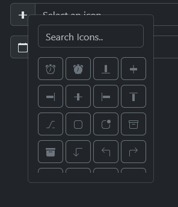

# Bootstrap 5 Icon Picker
I havent put this into packagist yet.

Inspired by [dogukanakkaya/iconpicker](https://github.com/dogukanakkaya/iconpicker)

Check out the [Codepen](https://codepen.io/Yohn/pen/oNKBwoQ)



## Example usage
#### HTML
```html
	<div class="input-group mb-3">
		<div class="input-group-text" id="yo-icon1"><i id="icon1" class="bi-alarm"></i></span></div>
		<input type="text" class="form-control" id="icon-picker-input" placeholder="Select an icon">
	</div>

	<div class="input-group">
		<div class="input-group-text" id="yo-icon2"><i id="icon2" class="bi-alarm"></i></div>
		<input type="text" class="form-control" id="another-icon-picker-input" placeholder="Select an icon">
	</div>
```
#### Icons from JSON url
```javascript
// Set the URL for the icons JSON file
IconPicker.setIconUrl(
	"https://unpkg.com/codethereal-iconpicker@1.2.1/dist/iconsets/bootstrap5.json"
);
```
#### Custom Icons Array
```javascript
IconPicker.setCustomIcons(['bi-alarm', 'bi-bag', 'bi-battery', 'bi-calendar', 'bi-camera']);
```
#### Initialize IconPickers for existing elements
```javascript
initializeIconPicker("yo-icon1", {
	iconTarget: "#icon1",
	defaultIcon: "bi-alarm",
	addClass: "bi",
	btnClass: "btn-outline-secondary",
	searchPlaceholder: "Search Icons.."
});
initializeIconPicker("yo-icon2", {
	iconTarget: "#icon2",
	defaultIcon: "bi-calendar"
});
```

#### To Destroy
```javascript
const iconPicker = new IconPicker('your-element-id', {
    iconTarget: '#icon-target',
    // other options...
});
iconPicker.destroy()
```